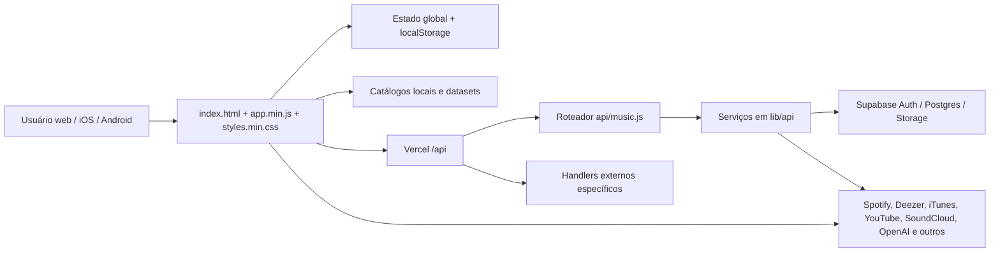

# Sonic Search — Auditoria técnica, de produto e de negócio

**Data da auditoria:** 14 de julho de 2026
**Escopo:** snapshot local do repositório, aplicação web, APIs serverless, banco Supabase, catálogo, scripts de qualidade e wrappers iOS/Android
**Natureza:** análise somente leitura; nenhuma implementação ou refatoração faz parte deste documento

> Nota de escopo: o working tree já estava extensamente alterado antes da auditoria, com 18 arquivos rastreados modificados e dezenas de itens não rastreados. Portanto, as conclusões descrevem o snapshot local analisado. Onde não foi possível provar que esse snapshot está em produção, o relatório diz isso explicitamente.

## 1. Resumo executivo

O Sonic Search já possui um núcleo de produto raro: uma taxonomia extensa de música eletrônica, sinais explícitos de gosto, filtros musicais específicos, explicações de recomendação e links para múltiplas fontes. A experiência consegue transmitir especialização — principalmente em Psytrance, Darkpsy, Techno e estilos adjacentes — e tem potencial real para produzir o momento de encantamento desejado: “como eu nunca tinha encontrado esse artista antes?”.

O maior problema atual não é falta de funcionalidade. É dispersão. O produto tenta ser, ao mesmo tempo, recomendador, diretório de DJs, feed de notícias, comunidade, estúdio, perfil colecionável, ferramenta social, agenda, canal de suporte e superfície de monetização. Essa amplitude dilui a promessa central, aumenta muito o bundle, torna a primeira recomendação longa e dificulta saber qual comportamento deve ser otimizado.

### Veredito

- **Tese de produto:** forte e diferenciada.
- **Catálogo e conhecimento de domínio:** acima da média para um produto em estágio inicial.
- **Experiência de primeira descoberta:** visualmente atraente, porém longa, ruidosa e com sinais contraditórios.
- **Qualidade percebida da recomendação:** promissora, mas ainda sem evidência quantitativa suficiente de novidade, acerto e retenção.
- **Base técnica:** funcional, mas concentrada em um monólito de frontend e em muitos estados globais.
- **Prontidão operacional:** limitada por ausência de build reproduzível no estado do Git, cobertura automatizada insuficiente e observabilidade fragmentada.
- **Risco mais grave:** uma função de banco `SECURITY DEFINER` aparentemente executável por `PUBLIC`, capaz de escrever no catálogo eletrônico. Isso precisa ser confirmado e fechado antes de qualquer novo deploy de banco.
- **Risco mais grave de produto:** “ouvintes recentes” e rankings comunitários são pessoas, cidades, reações e números sintetizados localmente, mas apresentados como atividade comunitária. Isso ameaça diretamente a confiança.

### Evidência de catálogo

O relatório de qualidade mais recente registra:

- 16.533 faixas auditadas;
- 3.648 artistas únicos;
- 5.179 artistas indexados no aplicativo;
- 98.401 músicas buscáveis estimadas;
- 5.533 labels;
- 169 estilos com faixas;
- 0 problemas críticos, 82 avisos e 21.981 notas de enriquecimento;
- apenas 16,8% de cobertura auditada sobre o universo buscável estimado.

Os 82 avisos se concentram principalmente em subgêneros muito rasos: vários têm duas a quatro entidades artísticas apesar de já atingirem a meta mínima de faixas. O tamanho nominal da taxonomia é forte para aquisição e exploração, mas ainda não equivale a profundidade uniforme de recomendação.

### Cinco conclusões que orientam o restante do relatório

1. **O núcleo deve ser “descoberta qualificada”, não quantidade de telas.** O produto precisa maximizar o número de artistas genuinamente novos que o usuário ouve e aprova.
2. **Confiança é parte do algoritmo.** Explicações, links tocáveis e sinais honestos valem mais que métricas sociais artificiais.
3. **A primeira sessão precisa chegar ao áudio mais rápido.** Privacidade, idioma e autenticação são compreensíveis, mas a recomendação posterior tem conteúdo demais antes de consolidar o primeiro “gostei/não gostei”.
4. **O catálogo é o ativo estratégico, mas o aprendizado ainda é pouco defensável.** Muito do perfil fica no dispositivo; sem histórico consistente e sem avaliação longitudinal, o efeito de dados é fraco.
5. **A operação precisa ser reproduzível.** O HTML rastreado referencia bundles, configuração e estrutura de build que não estão rastreados no snapshot. Um clone limpo não representa o aplicativo observado.

### Métrica norte recomendada

**Descobertas qualificadas por usuário ativo semanal (DQ/WAU):** número de faixas ou artistas que eram novos para o usuário, foram realmente reproduzidos e receberam um sinal positivo — curtida, salvamento, abertura de artista ou compartilhamento — dentro de uma janela definida.

Essa métrica traduz melhor a promessa do produto do que pageviews, buscas ou tempo bruto. Deve ser acompanhada por:

- tempo até a primeira reprodução;
- taxa de reprodução bem-sucedida;
- taxa “novo para mim”;
- aprovação após reprodução;
- rejeição e troca imediata;
- D1, D7 e D30;
- sessões de descoberta por semana;
- compartilhamentos e conversão do link compartilhado;
- falhas por fonte de áudio.

### Limitações da auditoria

- Não foram usados dados de produção, coortes reais, funis ou entrevistas com usuários.
- Integrações externas não foram exercitadas com credenciais reais.
- Não houve teste de carga, auditoria dinâmica de segurança contra ambiente remoto ou validação de regras já aplicadas no Supabase de produção.
- A UX foi exercitada localmente como convidado, com serviços opcionais desabilitados de forma segura.
- A auditoria não consegue garantir que migrações não rastreadas já tenham sido aplicadas ou que o deploy use os mesmos arquivos do snapshot.

## 2. Arquitetura do projeto

### Visão geral

### Camadas e responsabilidades

| Camada | Implementação atual | Avaliação |
| --- | --- | --- |
| Interface | HTML, CSS e JavaScript vanilla | Poucas dependências e controle fino, mas escala mal no tamanho atual. |
| Aplicação cliente | `app.js` com aproximadamente 60 mil linhas e 2,85 MB | Concentra recomendação, UI, áudio, perfil, comunidade, notícias, estúdio, suporte, analytics e persistência. É o maior risco de manutenibilidade. |
| Estilos | `styles.css` com aproximadamente 18,5 mil linhas e 398 KB | Boa riqueza visual e responsividade, porém muito acoplamento por seletores e alto custo de evolução. |
| Documento | `index.html` com aproximadamente 2,7 mil linhas e 173 KB | Muitas superfícies já estão no DOM inicial, mesmo quando não são parte da primeira jornada. |
| Backend | Funções serverless Vercel, com `api/music.js` como roteador e serviços em `lib/api` | Há boas proteções reutilizáveis, mas a quantidade de integrações e feature flags amplia a matriz operacional. |
| Dados | Datasets locais, catálogo v1, catálogo eletrônico v2, Supabase e resoluções externas | É a parte mais diferenciada do produto; ainda há sobreposição entre modelos e cobertura desigual. |
| Autenticação | Sessão local de convidado + Supabase/OAuth para perfil social | Bom caminho sem cadastro, porém a sessão OAuth é persistida em `localStorage`. |
| Nativo | Capacitor 8 com projetos iOS e Android e cópia do web bundle | Reutilização eficiente do frontend, mas os projetos e scripts não estão rastreados no snapshot. |
| Build | Terser, CleanCSS e scripts próprios | O bundle gerado confere com as fontes atuais, mas o contrato fonte → bundle não é reproduzível a partir de um clone do estado rastreado. |

### Organização e componentes

O repositório tem pastas coerentes para `api`, `lib/api`, `data`, `assets`, `scripts`, `supabase`, `mobile`, `ios`, `android`, `docs` e `reports`. A organização em diretórios, entretanto, não se repete dentro do frontend principal. `app.js` contém cerca de 1.736 declarações de função de nível superior, além de centenas de referências DOM, mapas, caches e variáveis mutáveis compartilhadas.

Na prática, os seguintes domínios estão no mesmo módulo e compartilham estado:

- onboarding, privacidade, idioma e autenticação;
- algoritmo de recomendação e filtros;
- player, previews e links externos;
- catálogo dinâmico e caches;
- favoritos, histórico, perfis e “espírito musical”;
- descoberta de artistas e DJs;
- notícias, eventos e comunidade;
- comentários e reações;
- Sound System/estúdio;
- compartilhamento e geração de imagem;
- suporte, Pix e Bitcoin;
- flags de beta, limites premium e analytics.

Esse desenho reduz fricção para prototipar, mas hoje torna qualquer alteração local potencialmente sistêmica. A ausência de fronteiras de módulo impede testes unitários naturais e favorece regressões entre telas sem relação aparente.

### Estado e persistência

O estado é predominantemente global no cliente e persistido em muitas chaves de `localStorage`. São armazenados idioma, consentimentos, preferências, progresso, exposição anônima, caches de catálogo, uso diário, perfil, colecionáveis, notícias, sessão social e tokens OAuth.

Pontos positivos:

- convidados conseguem experimentar o produto sem conta;
- várias leituras e escritas têm fallback para ambientes que bloqueiam storage;
- preferências e caches reduzem chamadas repetidas;
- há exportação e importação local de perfil.

Limitações:

- o perfil de gosto pode divergir entre dispositivos;
- limpeza do navegador ou reinstalação elimina sinais não sincronizados;
- tokens em `localStorage` aumentam o impacto de qualquer XSS;
- muitas versões e chaves legadas aumentam o custo de migração;
- não há uma única fonte de verdade clara para preferências, feedback e perfil social;
- falhas de quota ou documentos parcialmente inválidos são tratadas localmente, mas não observadas de forma central.

### Motor de recomendação

O motor implementa muito mais que escolha aleatória. Há sinais de estilo, família, BPM, energia, contexto, novidade, repetição, diversidade, maturidade do perfil, likes, dislikes, skips, confiança da fonte e gates de elegibilidade eletrônica. Também existem mecanismos de fallback e aquecimento de catálogo.

Essa riqueza é um ponto forte, mas está acoplada à interface e aos dados em `app.js`. Sem um conjunto versionado de casos de avaliação, não é possível separar facilmente “algoritmo sofisticado” de “melhoria comprovada”. Alterar um peso pode melhorar uma sessão e piorar um subgênero inteiro sem detecção automática.

### APIs e serviços externos

O backend centraliza verificações de método, origem, corpo, feature flags, beta grants e rate limit. Integrações incluem, conforme os handlers e configurações, Spotify, Deezer, iTunes, YouTube, SoundCloud, Ticketmaster, OpenAI, notícias, e-mail e Supabase.

Pontos positivos:

- ações sensíveis passam por módulos comuns;
- há validação de usuário Supabase para endpoints autenticados;
- respostas geralmente usam estruturas de erro previsíveis;
- limites duráveis podem usar armazenamento externo;
- APIs retornam `Cache-Control: no-store` quando apropriado;
- existe endpoint de saúde de integrações e analytics administrativo básico.

Pontos frágeis:

- disponibilidade depende de muitas credenciais e provedores;
- alguns serviços desabilitados ainda são chamados pelo cliente, gerando warnings evitáveis;
- a verificação de tamanho do corpo depende de `Content-Length`; o limite da plataforma reduz o risco, mas o módulo não mede o stream;
- a comunidade retorna HTTP 200 com `ok: false` em certas falhas, o que prejudica alertas baseados em status;
- não há correlação de request, tracing distribuído ou painel único de latência/erro por provedor.

### Banco de dados

O Supabase contém dois eixos principais:

1. **Produto/social:** perfis, feedback de faixas, eventos de feedback, snapshots de gosto, perfis/cartas de espírito, likes, follows, comentários, reações, atividade, RSVPs e recomendações.
2. **Conhecimento musical:** catálogo legado e um modelo eletrônico v2 normalizado, com artistas, aliases, IDs externos, gêneros, gravações, links de reprodução, evidências de fonte, execuções de ingestão e quarentena.

O modelo eletrônico v2 é conceitualmente sólido. Ele separa identidade, evidência, elegibilidade e fonte, permitindo curadoria auditável. Migrações posteriores reforçam a consistência do gate eletrônico e locks de estilo.

Há, contudo, dois riscos importantes:

- `upsert_electronic_artist_from_catalog` é `SECURITY DEFINER` e não há revogação explícita de `EXECUTE` de `PUBLIC` no conjunto analisado. Em PostgreSQL, novas funções são executáveis por `PUBLIC` por padrão; se exposta pelo PostgREST, a função pode permitir escrita privilegiada no catálogo por RPC.
- uma migração anterior concede leitura de todas as tabelas a `anon`/`authenticated`, escrita de todas a `authenticated` e repete isso em privilégios padrão. RLS reduz a exposição apenas quando cada tabela futura estiver corretamente protegida; o padrão é permissivo demais e cria risco silencioso.

A comunidade geral ainda usa um único JSON em Supabase Storage. Cada mutação lê o documento, altera em memória e sobrescreve o objeto. Duas gravações concorrentes podem perder dados. O limite de 300 posts também transforma crescimento em truncamento, não em paginação.

### Autenticação e autorização

- O modo convidado é uma boa decisão de ativação.
- O servidor valida o bearer token consultando `/auth/v1/user` no Supabase, em vez de confiar apenas em dados enviados pelo cliente.
- Perfis owner/moderator/premium são derivados de e-mails configurados.
- Há um e-mail pessoal fixo como fallback de owner. Em produção, autorização privilegiada deveria falhar fechada se a variável não estiver configurada.
- A sessão social completa é serializada em `localStorage`; combinada com CSP permissiva a inline script, isso aumenta a superfície de roubo de token.

### Segurança de aplicação

Controles já presentes:

- HSTS, `nosniff`, bloqueio de framing, política de referrer e permissions policy;
- CSP definida;
- validação de origem, com tratamento para Capacitor/Ionic;
- rate limits em endpoints de maior custo;
- beta grant assinado;
- validação de token no servidor;
- RLS em tabelas principais;
- uso predominante de `textContent` na renderização dinâmica.

Riscos:

- CSP contém `script-src 'unsafe-inline'`, `style-src 'unsafe-inline'` e `connect-src https:` amplo;
- token OAuth persistido em `localStorage`;
- função privilegiada possivelmente pública;
- grants padrão amplos no schema `public`;
- identidade de owner com fallback embutido no código;
- grande superfície cliente e múltiplos scripts externos aumentam o custo de revisão XSS;
- projetos, bundles e migrações críticas não rastreados dificultam provar exatamente o que foi publicado.

### Tratamento de erros e observabilidade

O frontend usa mensagens, toasts, estados desabilitados, placeholders e logs de console. O backend fornece erros de domínio e, em algumas rotas, degradação controlada. Há eventos de beta, health check de integrações e uma rota administrativa de analytics.

Faltam:

- captura central de exceções do cliente e servidor;
- IDs de correlação;
- métricas por provedor: latência, timeout, erro, cache hit e preview tocável;
- monitor de qualidade da recomendação por versão do algoritmo;
- alertas de regressão no funil principal;
- distinção operacional consistente entre “feature desabilitada”, “setup ausente”, “erro temporário” e “erro de programação”.

### Testes e verificações existentes

Foram executadas verificações somente leitura no snapshot:

- sintaxe de `app.js`: passou;
- suíte de segurança de requests: passou;
- smoke de APIs musicais: 10 de 10 cenários passaram;
- verificação de produto e gate eletrônico: passou;
- auditoria de recomendação eletrônica invocada pelo verificador: passou;
- comparação em memória dos bundles minificados com as fontes: os artefatos atuais correspondem às fontes atuais.

O verificador de produto emitiu um aviso relevante: arquivos de UI mudaram sem atualização correspondente de screenshots.

Lacunas:

- não há framework de testes unitários configurado;
- não há E2E automatizado para onboarding, recomendação, like, histórico e retorno;
- não há teste de acessibilidade automatizado;
- não há budget de performance;
- não há teste de concorrência para comunidade;
- não há avaliação estatística offline do recomendador;
- não há contrato automatizado de clone limpo → build web → build nativo → smoke.

### Manutenibilidade, dependências e escalabilidade

As dependências npm são enxutas e justificáveis: Capacitor, Terser e CleanCSS. Não foi encontrada uma dependência npm claramente desnecessária. O peso vem do código próprio, dos dados e da amplitude funcional, não do `node_modules`.

O repositório local ocupa cerca de 2,7 GB, incluindo aproximadamente 741 MB em `ios`, 725 MB em `reports`, 312 MB em `android`, 32 MB em `www`, 31 MB em `node_modules`, 17 MB em `data` e 13 MB em `assets`. Isso não representa o tamanho do download do aplicativo, mas indica acúmulo de builds, simuladores, screenshots e archives dentro da árvore de trabalho.

Há cópias com sufixo ` 2` em código, configuração, documentação e scripts. Algumas são idênticas e outras divergem, o que cria ambiguidade sobre qual arquivo é canônico.

Escala por componente:

- **Recomendação local:** escala em custo de CPU/memória do dispositivo; o monólito tende a piorar parse e interação em aparelhos modestos.
- **Catálogo Supabase:** o modelo normalizado pode escalar, desde que índices, paginação e gates sejam acompanhados.
- **Comunidade em JSON:** não escala com concorrência nem volume.
- **Rate limit em memória:** só é confiável por instância; a versão durável precisa estar obrigatoriamente configurada em produção.
- **Provedores externos:** são o maior risco de disponibilidade de reprodução; precisam de fallback medido.

## 3. Fluxo do usuário

### Primeira sessão observada

1. O usuário vê uma tela de privacidade.
2. Escolhe o idioma.
3. Encontra autenticação por Google/Apple e a opção clara de continuar como convidado.
4. Entra em “Descobrir”.
5. Pode pedir uma faixa imediatamente ou ajustar estilo/contexto.
6. Recebe capa, artista, música, estilo, confiança, justificativa e vários destinos de reprodução.
7. Depois encontra preview, feedback de áudio, rádio, ouvintes, comentários, material para DJ, ajustes rápidos, outra descoberta, avaliações e várias opções de salvar/bloquear/avançar.

O caminho sem cadastro é positivo. Entretanto, no desktop, a entrada chama `scrollIntoView` no painel de swipe e o teste começou aproximadamente 299 px abaixo do topo, ocultando parte do contexto da tela. Em viewport móvel, depois de uma única recomendação, a página de descoberta chegou a aproximadamente 7.534 px de altura. Não houve overflow horizontal, mas a quantidade vertical demonstra a falta de hierarquia progressiva.

### Onboarding e clareza da proposta

**O que funciona**

- A estética comunica música eletrônica, energia e especialização.
- “Continuar como convidado” reduz a principal barreira de ativação.
- O CTA de ouvir uma faixa é concreto.
- O sistema oferece surpresa e também controle explícito.

**O que confunde**

- Existem três decisões antes do áudio: privacidade, idioma e identidade.
- A tela de idioma mostrou título em inglês com Português já selecionado, sinal de localização incompleta.
- A marca “Search” pode sugerir uma busca textual convencional; a experiência principal é recomendação guiada.
- Ao entrar, dez destinos de navegação competem com o objetivo central.
- Mensagens sobre beta, Pro, premium, limites e apoio coexistem com um momento empresarial que declara não priorizar monetização.

### Primeira pesquisa e primeira descoberta

O Sonic Search oferece mais valor quando entende “pesquisa” como intenção musical: subgênero, BPM, energia, contexto e tolerância a novidade. Isso é mais profundo que uma caixa de texto. Para usuários que chegam com um artista em mente, porém, a divisão entre “Descobrir” e “DJs” pode não ser óbvia.

O primeiro resultado é visualmente forte e explica por que apareceu. Esse é um diferencial real frente a feeds opacos. O problema é o que vem em seguida: antes de o usuário consolidar o feedback essencial, a interface apresenta muitas ações secundárias. O gesto principal — ouvir e dizer se acertou — perde prioridade.

### Descoberta de músicas

Pontos fortes:

- combinação de filtros explícitos e aprendizado implícito;
- justificativa, confiança e metadados musicais;
- links para múltiplas plataformas;
- distinção entre “já conhecia”, “novo para mim”, “não combinou” e bloqueio;
- tentativa de variar catálogo e reduzir repetição.

Atritos:

- preview e destino de reprodução podem depender de terceiros;
- várias ações parecem semanticamente próximas: curtir, salvar faixa, salvar descoberta, “novo para mim” e avaliar;
- o resultado ocupa muito espaço e exige leitura extensa;
- confiança percentual parece precisa, mas não há calibração visível para o usuário;
- uma sugestão adjacente pode saltar de Detroit Techno para Gabber sem explicar a ponte, enfraquecendo a coerência percebida.

### Descoberta de artistas

O produto tem boa matéria-prima para ir além da faixa: bios, estilos, labels, cidade/país, aliases, IDs externos e relações por gênero. A jornada atual, entretanto, privilegia uma grande ficha de faixa e muitas funções paralelas. O “por que este artista é especial para você” poderia ser o centro da descoberta, mas compete com rádio, comunidade, DJ e gamificação.

### Favoritos, histórico e perfil

Há muitas formas de registrar intenção, o que é útil para o algoritmo, mas o modelo mental não está claro. O usuário precisa entender a diferença entre:

- curtir;
- salvar faixa;
- salvar artista;
- salvar descoberta;
- marcar como novo ou conhecido;
- bloquear;
- avaliar conexão/reprodução/troca.

O perfil tem estados vazios razoavelmente explicativos e uma proposta de identidade musical compartilhável. Porém, na sessão testada, com zero curtidas, “DNA dominante” mostrou Gabber após uma recomendação de Detroit Techno. O código usa contexto de estilo, recomendação e descoberta mesmo sem perfil consolidado. Isso faz o produto parecer excessivamente confiante antes de aprender.

### Recomendações e aprendizado

O sistema coleta sinais ricos, mas o usuário não sabe quais são essenciais. Para retenção, a relação causa–efeito precisa ser evidente: “você marcou X; por isso o próximo resultado mudou em Y”. A interface já contém explicações, mas elas estão espalhadas entre muitos blocos.

O melhor loop é curto:

**ouvir → dizer se é novo → aprovar/rejeitar → entender o ajuste → receber a próxima faixa.**

Tudo que não reforça esse ciclo na primeira sessão deve ser progressivo ou secundário.

### Navegação

A navegação observada contém Descobrir, DJs, Filtros, Notícias, Comunidade, Estúdio, Perfil, Sobre, Contato e Avisos. Para um usuário novo, essa arquitetura não indica qual é o trabalho principal. Notícias, suporte, avisos e sobre têm baixo valor antes do primeiro sucesso musical; Estúdio atende um caso de uso diferente; Comunidade sofre sem densidade real.

### Mensagens de erro, estados vazios e carregamento

- Há mensagens, placeholders, estados desabilitados e fallback em várias áreas.
- Estados vazios do perfil orientam o próximo passo melhor que uma tela em branco.
- Recursos assíncronos costumam dar algum feedback visual.
- Uma feature desabilitada de comentários ainda foi chamada e gerou warning no console; o usuário pode não ver o warning, mas isso sinaliza contrato inconsistente de disponibilidade.
- Algumas rotas comunitárias devolvem HTTP 200 mesmo em falha operacional, dificultando diagnóstico.
- Falta uma linguagem uniforme para “não configurado”, “temporariamente indisponível”, “não encontrado” e “você precisa entrar”.

### Velocidade percebida

O app usa carregamento em segundo plano, lazy loading de imagens, caches e aquecimento adiado, o que ajuda. A tela inicial, porém, ainda precisa analisar um bundle JavaScript grande e manter um DOM extenso. Em dispositivos modestos, o risco não é apenas download; é parse, execução, memória e custo de atualizar componentes que não fazem parte da tarefa atual.

### Onde o usuário pode desistir

1. Antes de ouvir, por excesso de gates iniciais.
2. Ao entrar no desktop já deslocado para o meio da tela.
3. Ao não entender se deve pesquisar, filtrar ou pedir surpresa.
4. Quando um preview falha ou abre outra plataforma cedo demais.
5. Ao receber um resultado correto, mas encarar ações demais.
6. Ao perceber um perfil musical incorreto com pouca evidência.
7. Ao notar atividade comunitária que parece artificial.
8. Ao trocar de dispositivo e não encontrar o mesmo aprendizado.

### O que gera encantamento

- um artista obscuro, tocável e muito alinhado ao subgênero escolhido;
- uma explicação curta e musicalmente inteligente;
- mostrar que o artista é novo para o usuário, sem inventar certeza;
- o próximo resultado melhorar imediatamente após o feedback;
- revelar conexões entre cenas, labels e subgêneros com uma ponte compreensível;
- criar uma carta de identidade musical apenas depois de evidência suficiente.

### O que faria alguém voltar amanhã

- uma seleção diária pequena, claramente melhor que a de hoje;
- continuidade do perfil em qualquer dispositivo;
- histórico que mostra evolução do gosto e evita repetição;
- novidades de artistas realmente aprovados;
- uma promessa concreta, como “3 descobertas novas para seu lado Darkpsy hoje”, não um feed genérico.

### O que faria alguém indicar a um amigo

- compartilhar uma descoberta com preview funcional e explicação do match;
- comparar perfis musicais reais, não rankings artificiais;
- enviar uma mini-rota de três faixas para um subgênero;
- a reputação de encontrar artistas que Spotify e playlists genéricas não mostram;
- um link compartilhado que entrega valor antes de pedir cadastro.

### Análise de negócio e crescimento

#### Ativação

O evento de ativação deve ser: **primeira faixa reproduzida + primeiro feedback explícito em até 90 segundos**, preferencialmente acompanhada de “novo para mim”. Cadastro não deve ser o evento de ativação.

#### Retenção

A retenção depende de o sistema demonstrar memória e melhora. Recursos sociais, notícias e estúdio não compensam recomendações medianas. O principal teste de retenção é se a segunda e a terceira sessão produzem mais aprovação com menos configuração.

#### Engajamento

Profundidade de catálogo, sequência coerente e feedback rápido são engajamento saudável. Altura de página, quantidade de botões e tempo passivo não são. O produto deve evitar otimizar tempo de tela sem áudio.

#### Viralização

Já existem assets e fluxos de compartilhamento, mas o loop viral precisa ser centrado no valor recebido pelo destinatário. Uma carta bonita sem preview ou sem contexto converte pouco. Compartilhamento deve abrir uma descoberta funcional e permitir que o amigo responda “combina comigo/não combina”.

#### Efeito de rede

Hoje, o melhor efeito de rede possível ainda é de dados: mais feedback confiável melhora relações entre estilos, artistas e perfis semelhantes. A comunidade visível não tem densidade suficiente e parte da prova social é sintetizada. Um marketplace social cedo demais produz estados vazios ou atividade artificial. A utilidade individual precisa vir primeiro.

#### Vantagem competitiva e barreiras de entrada

| Plataforma | Vantagem dela | Espaço do Sonic Search |
| --- | --- | --- |
| Spotify | escala, catálogo licenciado, histórico e personalização ampla | profundidade de subgênero, controle explícito, transparência e descoberta cross-platform. |
| SoundCloud | underground, uploads e comunidades de cena | curadoria de qualidade, redução de ruído e conexões entre fontes. |
| Beatport | taxonomia eletrônica, credibilidade de DJ e comércio | aprendizado pessoal, narrativa de gosto e descoberta para ouvir, não apenas comprar. |
| Bandcamp | relação artista–fã, contexto e compra direta | motor que encontra o artista certo e encaminha valor ao ecossistema. |
| YouTube | cobertura e disponibilidade | intenção musical estruturada e menos dependência do ranking de popularidade. |

A barreira real não será a interface. Será um **grafo proprietário de gosto eletrônico**, ligando evidências de catálogo, relações de subgênero, qualidade/tocabilidade da fonte e respostas reais de usuários ao longo do tempo. No estado atual, parte importante desse aprendizado é local, a cobertura é desigual e faltam avaliações que provem melhora. Logo, a vantagem é promissora, mas ainda não consolidada.

## 4. Pontos fortes

1. **Proposta vertical clara no núcleo:** descoberta profunda de música eletrônica é um recorte defensável e emocional.
2. **Taxonomia extensa:** 169 estilos permitem expressar gostos que plataformas generalistas frequentemente achatam.
3. **Catálogo com evidência:** o modelo eletrônico v2 separa artista, gravação, gênero, fonte, confiança e quarentena.
4. **Gates de qualidade:** a recomendação tenta impedir entidades sem evidência eletrônica ou gravação elegível.
5. **Explicabilidade:** o usuário recebe razões, metadados e contexto, não apenas uma capa.
6. **Feedback granular:** likes, dislikes, skips, novo/conhecido, conexão e bloqueio oferecem sinais úteis.
7. **Acesso como convidado:** permite experimentar antes de criar conta.
8. **Múltiplas fontes:** reduz lock-in e aumenta a chance de encontrar artistas fora de um único catálogo.
9. **Boa identidade visual:** a estética é coerente com a cena eletrônica e as telas responsivas não apresentaram overflow horizontal no teste.
10. **Filtros com divulgação progressiva:** a tela de filtros mostra rotas principais e contexto sem despejar os 169 estilos de uma vez.
11. **Cuidados de acessibilidade já iniciados:** foco visível, `prefers-reduced-motion`, regiões ao vivo e labels existem em muitas áreas.
12. **Proteções serverless reutilizáveis:** origem, rate limit, método, beta grant e validação Supabase estão centralizados.
13. **Dependências enxutas:** o projeto não depende de um framework pesado nem de uma árvore npm excessiva.
14. **Scripts de qualidade:** há auditoria de catálogo, verificação de produto, build nativo e smoke tests úteis.
15. **Potencial de compartilhamento:** cartas, perfis e rotas de descoberta podem formar um loop viral compatível com o produto.

## 5. Pontos fracos

### Produto

- A promessa central compete com dez destinos de navegação.
- Monetização, tips, premium, beta, comunidade e estúdio aparecem antes de o motor provar valor recorrente.
- O primeiro resultado tem informações e ações demais.
- A diferença entre curtir, salvar, avaliar e marcar novidade não é autoevidente.
- Atividade social sintetizada compromete confiança.
- O perfil faz inferências com pouca evidência.
- O produto ainda não demonstra, por métrica, que encontra artistas melhores que alternativas.

### Engenharia

- `app.js`, `styles.css` e `index.html` formam um monólito de interface.
- Estado global e acesso direto ao DOM criam acoplamento forte.
- Não há suíte unitária/E2E convencional.
- Bundle inicial grande e pouca separação por rota.
- Artefatos, scripts e projetos críticos não estão rastreados no snapshot.
- Há cópias de arquivos com nomes ambíguos.
- Configurações de limite divergem entre `app.js` e `index.html`.
- A comunidade usa read–modify–write de um JSON único.

### Dados e aprendizado

- A cobertura auditada representa 16,8% do universo buscável estimado.
- Muitos estilos têm apenas dois artistas, o que cria falsa sensação de profundidade.
- O perfil completo não é consistente entre dispositivos.
- Não há benchmark versionado de relevância/novidade/diversidade.
- A precisão exibida ao usuário não tem calibração pública ou teste conhecido.

### Operação

- Não há build reproduzível comprovado em clone limpo.
- Não há observabilidade central ou SLO por integração.
- Erros de feature desabilitada geram ruído.
- Releases visuais podem ocorrer sem screenshots atualizadas.
- A árvore local contém centenas de megabytes de builds e relatórios.

## 6. Bugs aparentes

“Aparente” significa confirmado no código ou no teste local, mas não necessariamente reproduzido no ambiente de produção.

| Severidade | Evidência | Comportamento e impacto | Confiança |
| --- | --- | --- | --- |
| Crítica | `supabase/migrations/20260713000200_electronic_catalog_v2.sql` | Função `SECURITY DEFINER` de upsert não tem `REVOKE EXECUTE FROM PUBLIC` visível. Pode expor escrita privilegiada por RPC. | Alta no snapshot; aplicação em produção não confirmada. |
| Alta | `index.html` + estado do Git | O HTML rastreado referencia `app.min.js` e `styles.min.css`, mas ambos são não rastreados; `package.json`, lockfile, Capacitor e projetos nativos também são não rastreados. Clone limpo pode não construir nem servir a UI observada. | Alta. |
| Alta | `app.js` em `generateRecentListeners` e `generateTopListeners` | Nomes, cidades, minutos, reações, scores e plays são gerados por hash e apresentados como ouvintes/comunidade. | Confirmada. |
| Média | `enterAppFromWelcome` | No desktop, a entrada rola até o painel de swipe. O teste abriu cerca de 299 px abaixo do topo, cortando contexto e hierarquia. | Confirmada localmente. |
| Média | `resolveMusicalSpirit` e perfil | Com zero curtidas, contexto de recomendação/descoberta pode virar “DNA dominante”. A sessão mostrou Gabber após Detroit Techno. | Confirmada localmente e compatível com o código. |
| Média | UI em inglês | Labels ARIA e blocos sociais permaneceram em português em uma sessão configurada para inglês. | Confirmada localmente. |
| Baixa | carregamento de comentários | O cliente tentou carregar comentários com a feature desabilitada e registrou `music_api_disabled` como warning. | Confirmada localmente. |
| Alta sob concorrência | `lib/api/_community.js` | Mutação lê um único `feed.json` e o sobrescreve sem versão/lock. Duas gravações podem perder uma postagem, reação ou exclusão. | Alta por inspeção. |
| Média | `app.js` e `index.html` | O limite gratuito padrão é 80 em um arquivo e 50 no outro. O valor efetivo depende da ordem/configuração e pode variar entre builds. | Confirmada no código. |
| Baixa | arquivos `* 2.*` | Há cópias idênticas e divergentes de serviços, scripts e configurações; uma manutenção pode corrigir a cópia errada. | Confirmada. |

## 7. Riscos técnicos

### Segurança

1. **Escalada de privilégio no catálogo:** função `SECURITY DEFINER` potencialmente pública.
2. **Privilégios padrão permissivos:** uma nova tabela sem RLS correto pode ser lida ou escrita por papéis públicos.
3. **Impacto ampliado de XSS:** token em `localStorage`, CSP com inline permitido e superfície cliente muito grande.
4. **Owner implícito:** fallback de e-mail privilegiado no código em vez de configuração obrigatória.
5. **Proveniência de deploy:** arquivos não rastreados dificultam auditoria do artefato publicado.

### Integridade de dados

1. **Lost update na comunidade:** ausência de transação e concorrência otimista.
2. **Sobreposição de modelos:** catálogo legado, v2, datasets locais e caches podem divergir.
3. **Sinais locais incompletos:** recomendações podem recomeçar ou contradizer o perfil após troca de dispositivo.
4. **Cobertura rasa:** estilos com poucos artistas geram repetição e baixa novidade.
5. **Truncamento comunitário:** feed limita o documento a 300 posts, descartando o excedente em vez de paginar.

### Disponibilidade

1. **Dependência de terceiros:** preview, busca, metadados e imagens atravessam múltiplos provedores.
2. **Feature flags inconsistentes:** cliente e servidor podem discordar sobre disponibilidade.
3. **Rate limit não durável:** configuração incorreta pode permitir abuso distribuído ou bloquear de modo inconsistente.
4. **Serverless + chamadas encadeadas:** latência de cold start e timeout podem degradar a primeira reprodução.

### Evolução

1. **Monólito de 60 mil linhas:** alto risco de regressão e baixa velocidade de revisão.
2. **CSS de 18,5 mil linhas:** conflitos de especificidade e estados visuais difíceis de isolar.
3. **DOM inicial extenso:** cada nova superfície aumenta custo mesmo sem uso.
4. **Ausência de testes comportamentais:** mudanças em pesos, persistência ou onboarding não têm rede de segurança.
5. **Artefatos duplicados:** correções podem não chegar ao arquivo realmente executado.
6. **Configuração espalhada:** limites, flags e dados de suporte aparecem em HTML, JS, env e runtime móvel.

### Escalabilidade organizacional

O código atual pode ser mantido por quem conhece sua história, mas é difícil para uma equipe crescer. Um novo engenheiro precisa compreender grande parte do arquivo principal para alterar uma tela. Product analytics também ficam misturados com regras de UI e recomendação, dificultando experimentos independentes.

## 8. Problemas de UX

### P0 de confiança

- Ouvintes recentes e top listeners sintetizados parecem atividade humana real.
- Números precisos de confiança e ranking podem soar mais científicos que a evidência disponível.

### Ativação

- Três decisões antes da primeira música.
- Entrada desktop deslocada do topo.
- Proposta “Search” sem um caminho textual imediatamente óbvio.
- Muitos destinos antes de o usuário formar um hábito.

### Hierarquia da recomendação

- A tela principal acumula metadados, players, comunidade, DJ, sugestões, avaliações e saves.
- Há mais de uma dezena de ações possíveis depois de uma faixa.
- A próxima decisão essencial não permanece sempre dominante.
- Em móvel, uma recomendação produz vários milhares de pixels de rolagem.

### Modelo mental

- “Curtir”, “salvar”, “novo”, “conectou” e “salvar descoberta” se sobrepõem.
- “Perfil”, “espírito” e “DNA dominante” sugerem conclusões antes de haver amostra suficiente.
- A ponte entre estilos adjacentes não é explicada quando o sistema explora fora do contexto imediato.

### Navegação e escopo

- Notícias e Avisos são feeds diferentes sem prioridade para a descoberta.
- Estúdio/Sound System atende criação e performance, não necessariamente descoberta.
- Contato/Apoio ocupa um destino principal.
- Sobre e suporte poderiam ser utilitários, não pares de “Descobrir”.
- Premium e limits contradizem a prioridade atual de retenção.

### Acessibilidade e localização

- Labels ARIA misturam idiomas.
- Elementos decorativos e emojis aparecem na árvore de acessibilidade.
- A tela principal observada começa com heading de nível 2, indicando hierarquia incompleta.
- Rails horizontais nem sempre tornam o gesto lateral evidente.
- Existem boas bases de foco e reduced motion, mas faltam testes automatizados e revisão completa por teclado/leitor de tela.

### Feedback, erros e vazios

- Estados vazios do perfil orientam, mas podem ser contraditos por DNA prematuro.
- Recursos indisponíveis deveriam desaparecer ou explicar claramente a indisponibilidade.
- Abrir plataforma externa cedo pode parecer fuga do produto.
- Falta uma promessa de retomada: o que mudou desde a última visita e por que voltar agora.

## 9. Problemas de performance

### Bundle inicial

Tamanhos observados no snapshot:

- `app.js`: 2.850.034 bytes, 60.085 linhas;
- `app.min.js`: 2.151.560 bytes;
- `styles.css`: 398.445 bytes, 18.530 linhas;
- `styles.min.css`: 322.546 bytes;
- `index.html`: 172.623 bytes, 2.668 linhas.

Mesmo com compressão HTTP, o navegador ainda precisa descomprimir, analisar e executar mais de 2 MB de JavaScript minificado. O custo é especialmente relevante em celulares intermediários e dentro de WebView nativa.

### DOM e renderização

Muitas superfícies estão no HTML inicial e são apenas ocultadas. O navegador paga parte do custo de parse, estilo e memória antes de o usuário visitar Notícias, Comunidade, Estúdio, Perfil ou Suporte. A recomendação também cria uma página muito longa, aumentando custo de layout e quantidade de nós ativos.

### Dados e caches

- Catálogos são aquecidos em background, uma boa estratégia.
- Há cache local de catálogo dinâmico, notícias, IA e preferências.
- A multiplicidade de caches aumenta invalidação e uso de quota.
- Datasets extensos e metadados embutidos podem pressionar memória no WebView.
- Não há telemetria de cache hit, tempo de parse, long tasks ou memory pressure.

### Rede

- A recomendação pode depender de metadados, imagens, preview e múltiplos destinos externos.
- Falta um orçamento de chamadas para a primeira descoberta.
- Falhas de terceiros podem aumentar tempo percebido mesmo quando o algoritmo local é rápido.
- Scripts/fontes externos e políticas amplas adicionam conexões antes ou durante o uso.

### Build e distribuição

O diretório `www` ocupa cerca de 32 MB e os projetos nativos contêm cópias e builds. Sem um pipeline limpo e versionado, é difícil acompanhar regressão de tamanho por release. O tamanho de 2,7 GB do repositório local não é tamanho de download, mas prejudica CI, backup, revisão e onboarding técnico.

### Ausência de budgets

Não foram encontrados gates para:

- bytes de JS/CSS/HTML;
- Largest Contentful Paint;
- Interaction to Next Paint;
- long tasks;
- tempo até primeira faixa tocável;
- número de requests na ativação;
- memória do WebView;
- falha de preview por provedor.

## 10. Melhorias sugeridas

### Convenção de esforço

- **XS:** até 1 dia de trabalho.
- **S:** 2 a 4 dias.
- **M:** 1 a 2 semanas.
- **L:** 3 a 6 semanas ou mudança estrutural.

### P0 — urgente

#### P0-1. Fechar a função privilegiada do catálogo

- **Problema:** `upsert_electronic_artist_from_catalog` é `SECURITY DEFINER` e não possui revogação explícita de execução pública no snapshot.
- **Impacto esperado:** elimina um possível caminho de escrita não autorizada, envenenamento de catálogo e bypass de RLS.
- **Esforço estimado:** XS.
- **Risco:** baixo se o acesso for mantido apenas para o papel de serviço usado pela ingestão; alto risco de não agir.
- **Arquivos envolvidos:** `supabase/migrations/20260713000200_electronic_catalog_v2.sql`, uma nova migração de hardening, scripts de importação e testes de segurança.
- **Como validar:** consultar privilégios efetivos em produção; provar que `anon` e `authenticated` não executam a RPC; provar que `service_role` continua importando; revisar todas as funções `SECURITY DEFINER`.
- **Métrica que deve melhorar:** zero execuções privilegiadas não autorizadas; zero findings críticos no audit de banco; ingestões autorizadas com 100% de sucesso.

#### P0-2. Tornar o release reproduzível a partir de um clone limpo

- **Problema:** bundles referenciados, manifesto npm, lockfile, configuração Capacitor, projetos nativos, scripts e migrações críticas estão não rastreados no snapshot.
- **Impacto esperado:** reduz releases quebrados, divergência entre código e loja, rollback incerto e tempo de recuperação.
- **Esforço estimado:** S.
- **Risco:** baixo; requer decidir explicitamente quais artefatos são fonte e quais são gerados.
- **Arquivos envolvidos:** `package.json`, `pnpm-lock.yaml`, `app.min.js`, `styles.min.css`, `capacitor.config.json`, `.gitignore`, `.vercelignore`, `scripts/build-*.mjs`, `mobile/`, `ios/`, `android/` e configuração de CI.
- **Como validar:** em diretório vazio, clonar, instalar com lockfile congelado, gerar web, sincronizar nativo e executar smoke sem arquivos locais extras; comparar hashes do artefato com o release.
- **Métrica que deve melhorar:** taxa de builds limpos bem-sucedidos para 100%; zero deploys sem proveniência; menor tempo de rollback e onboarding.

#### P0-3. Remover ou rotular inequivocamente toda prova social sintética

- **Problema:** ouvintes, cidades, horários, reações, scores e plays são gerados localmente e apresentados como comunidade real.
- **Impacto esperado:** preserva confiança, evita sensação de manipulação e protege reputação quando o produto crescer.
- **Esforço estimado:** XS a S.
- **Risco:** baixo; a tela pode ficar menos “cheia” até haver atividade real, o que é preferível a dados fictícios.
- **Arquivos envolvidos:** `app.js`, `index.html`, `styles.css` e, se houver dados reais, APIs/tabelas de atividade.
- **Como validar:** revisão de todas as claims sociais; teste mostra apenas dados reais, estado vazio honesto ou rótulo explícito de demonstração; nenhum número humano é derivado por hash.
- **Métrica que deve melhorar:** zero claims sociais artificiais; aumento de confiança em pesquisa qualitativa; redução de abandono após abrir detalhes comunitários.

### P1 — alto impacto

#### P1-1. Corrigir a entrada e reduzir o tempo até a primeira reprodução

- **Problema:** o desktop entra deslocado para o painel interno e o usuário enfrenta decisões antes do áudio.
- **Impacto esperado:** melhora compreensão, ativação e velocidade percebida.
- **Esforço estimado:** XS a S.
- **Risco:** baixo.
- **Arquivos envolvidos:** `app.js`, `index.html` e `styles.css`.
- **Como validar:** novos usuários em desktop e mobile sempre veem contexto, promessa e CTA primário; medir sessão limpa até `play_started` e primeiro feedback.
- **Métrica que deve melhorar:** tempo mediano até primeira reprodução; taxa de primeira reprodução; ativação em 90 segundos.

#### P1-2. Manter o perfil neutro até haver evidência suficiente

- **Problema:** “DNA dominante” e espírito podem usar contexto temporário com zero curtidas e apresentar uma identidade incorreta.
- **Impacto esperado:** aumenta confiança nas recomendações e torna a evolução do perfil crível.
- **Esforço estimado:** S.
- **Risco:** baixo.
- **Arquivos envolvidos:** `app.js`, textos de perfil em `index.html` e testes de cold start.
- **Como validar:** com zero feedback, mostrar apenas calibração; com uma amostra mínima, exibir sinais provisórios; testar sequências contraditórias e retorno de sessão.
- **Métrica que deve melhorar:** concordância declarada com o perfil; menor correção manual; maior taxa de conclusão até o desbloqueio do perfil.

#### P1-3. Aplicar divulgação progressiva na recomendação

- **Problema:** uma única recomendação expõe muitos blocos e ações, produzindo uma página móvel muito longa.
- **Impacto esperado:** aumenta a taxa de ouvir e responder, reduz fadiga e torna o produto mais rápido visualmente.
- **Esforço estimado:** M.
- **Risco:** baixo a médio; funções secundárias precisam continuar encontráveis.
- **Arquivos envolvidos:** `index.html`, `styles.css`, `app.js` e screenshots de produto.
- **Como validar:** teste de usabilidade com usuários novos; comparar versão atual com uma sequência centrada em capa, play, razão e três sinais essenciais; medir descoberta de recursos secundários.
- **Métrica que deve melhorar:** reprodução por recomendação; feedback por reprodução; tempo até próxima faixa; redução de abandono na primeira recomendação.

#### P1-4. Instrumentar o funil de descoberta e a qualidade percebida

- **Problema:** há eventos de beta, mas não um funil canônico que prove novidade, tocabilidade, acerto e retenção por versão do recomendador.
- **Impacto esperado:** permite priorizar por evidência e descobrir quais estilos/fontes realmente retêm usuários.
- **Esforço estimado:** M.
- **Risco:** baixo, desde que consentimento e minimização de dados sejam mantidos.
- **Arquivos envolvidos:** `app.js`, `lib/api/_beta-events.js`, `lib/api/_admin-analytics.js`, migrações de analytics, política de privacidade e dashboards.
- **Como validar:** evento a evento em uma sessão de teste; funil fecha sem duplicidade; versão do algoritmo, fonte e estilo são atribuíveis sem armazenar dados desnecessários.
- **Métrica que deve melhorar:** cobertura do funil acima de 95%; DQ/WAU mensurável; tempo de detecção de regressão.

#### P1-5. Tornar reprodução e disponibilidade de feature observáveis e coerentes

- **Problema:** serviços desabilitados ainda podem ser chamados; previews dependem de terceiros sem SLO visível.
- **Impacto esperado:** menos becos sem saída e melhor percepção de velocidade/confiabilidade.
- **Esforço estimado:** S a M.
- **Risco:** baixo.
- **Arquivos envolvidos:** `app.js`, `api/music.js`, `lib/api/_music-apis.js`, handlers de provedores e health check.
- **Como validar:** matriz de flags cliente/servidor; simular timeout/403/404 por provedor; confirmar fallback e mensagem; não gerar warning para feature intencionalmente desligada.
- **Métrica que deve melhorar:** taxa de reprodução bem-sucedida; erro por provedor; tempo até fallback; warnings por sessão.

#### P1-6. Completar localização e acessibilidade da jornada principal

- **Problema:** labels ARIA e blocos permanecem em português quando a UI está em inglês; há ruído decorativo na árvore e hierarquia de headings incompleta.
- **Impacto esperado:** amplia alcance, reduz confusão e melhora uso por teclado/leitor de tela.
- **Esforço estimado:** S a M.
- **Risco:** baixo.
- **Arquivos envolvidos:** `index.html`, `app.js`, `styles.css` e testes automatizados de acessibilidade.
- **Como validar:** varredura em português, inglês e espanhol; navegação completa por teclado; leitor de tela; contraste; reduced motion; alvos de toque.
- **Métrica que deve melhorar:** zero strings fora do idioma; zero violações críticas de acessibilidade; maior conclusão de onboarding por idioma.

#### P1-7. Recentrar a arquitetura de informação no motor de descoberta

- **Problema:** dez destinos principais e superfícies de premium, tips, notícias e estúdio diluem o foco atual de retenção.
- **Impacto esperado:** proposta mais clara, mais sessões no loop de descoberta e menor custo cognitivo.
- **Esforço estimado:** M.
- **Risco:** médio; usuários existentes podem usar recursos secundários.
- **Arquivos envolvidos:** `index.html`, `app.js`, `styles.css`, `mobile/sonic-ios-runtime.js`, README e feature flags.
- **Como validar:** card sorting e teste de árvore; comparar navegação reduzida com a atual; monitorar acesso a recursos movidos para “Mais”.
- **Métrica que deve melhorar:** sessões que iniciam descoberta; ativação; cliques dispersos antes do primeiro play; retenção D1/D7.

#### P1-8. Priorizar profundidade e coerência do catálogo antes de ampliar estilos

- **Problema:** vários estilos têm duas a quatro entidades artísticas e a sugestão adjacente nem sempre explica a ponte musical.
- **Impacto esperado:** mais novidade real, menos repetição e maior credibilidade entre fãs especializados.
- **Esforço estimado:** M e contínuo.
- **Risco:** baixo; o catálogo nominal pode crescer mais devagar.
- **Arquivos envolvidos:** `data/`, `scripts/quality-audit.mjs`, scripts de ingestão, `reports/quality-audit-latest.md`, tabelas/migrações de catálogo e regras do recomendador em `app.js`.
- **Como validar:** definir piso de artistas e faixas tocáveis por estilo ativo; avaliações cegas por especialistas; medir repetição e aprovação por subgênero.
- **Métrica que deve melhorar:** artistas tocáveis por estilo; DQ/WAU; taxa “novo para mim + gostei”; menor repetição em 20 recomendações.

#### P1-9. Endurecer privilégios, sessão e CSP

- **Problema:** grants padrão amplos, owner fallback embutido, token em `localStorage` e CSP permissiva elevam o impacto de falhas futuras.
- **Impacto esperado:** reduz exposição de dados e credenciais e torna autorização fail-closed.
- **Esforço estimado:** M.
- **Risco:** médio; mudanças em sessão e CSP podem quebrar OAuth ou integrações se feitas sem rollout.
- **Arquivos envolvidos:** `supabase/migrations/20260619022000_grant_data_api_roles.sql`, nova migração de hardening, `lib/api/_access-control.js`, `app.js`, `index.html`, `vercel.json` e configuração Supabase.
- **Como validar:** matriz de permissões por papel/tabela/função; CSP em report-only antes de bloquear; testes OAuth web/nativo; nenhum owner sem variável explícita.
- **Métrica que deve melhorar:** findings de segurança; violações CSP; tentativas negadas corretamente; zero regressão de login.

#### P1-10. Transformar verificações existentes em gate de CI

- **Problema:** bons scripts existem, mas não há prova de execução obrigatória em clone limpo nem gate visual, E2E, acessibilidade e budget.
- **Impacto esperado:** reduz regressões e aumenta velocidade de release com confiança.
- **Esforço estimado:** M.
- **Risco:** baixo a médio; testes frágeis podem atrasar até estabilizar.
- **Arquivos envolvidos:** `package.json`, scripts em `scripts/`, configuração de CI, fixtures, screenshots e reports.
- **Como validar:** pull request de teste falha para erro intencional de catálogo, UI, segurança e budget; pipeline limpo passa de forma determinística.
- **Métrica que deve melhorar:** regressões pós-release; tempo de correção; taxa de builds verdes; cobertura das jornadas críticas.

### P2 — médio impacto

#### P2-1. Separar o frontend por domínio e carregar superfícies sob demanda

- **Problema:** todo o produto está concentrado em um bundle e em estado global.
- **Impacto esperado:** melhora performance, testabilidade, ownership e velocidade de mudança.
- **Esforço estimado:** L.
- **Risco:** médio a alto; refatoração estrutural sem testes pode introduzir regressões.
- **Arquivos envolvidos:** `app.js`, `index.html`, `styles.css`, scripts de build e novos módulos por domínio.
- **Como validar:** migração incremental por feature; paridade E2E; redução de bundle inicial; ausência de regressões de estado.
- **Métrica que deve melhorar:** bytes e tempo de parse inicial; tempo de review; bugs por mudança; cobertura unitária.

#### P2-2. Sincronizar o grafo de gosto entre dispositivos

- **Problema:** dislikes, skips, preferências, maturidade e partes do perfil dependem de armazenamento local.
- **Impacto esperado:** melhora retenção, consistência e defensibilidade do aprendizado.
- **Esforço estimado:** L.
- **Risco:** médio; exige resolução de conflitos, privacidade e migração de convidados.
- **Arquivos envolvidos:** `app.js`, tabelas de feedback/perfil, RLS, auth, APIs de sync e exportação/importação.
- **Como validar:** começar convidado, entrar e migrar; usar dois dispositivos; testar offline, conflito e exclusão de conta.
- **Métrica que deve melhorar:** perfis recuperados; continuidade cross-device; D7/D30; menor repetição após troca de dispositivo.

#### P2-3. Migrar a comunidade de JSON para dados transacionais

- **Problema:** feed único em Storage perde atualizações concorrentes, limita volume e mistura post/reação em um documento.
- **Impacto esperado:** integridade, paginação, moderação e escala reais.
- **Esforço estimado:** M a L.
- **Risco:** médio; migração e compatibilidade precisam preservar dados.
- **Arquivos envolvidos:** `lib/api/_community.js`, migrações Supabase, RLS, cliente comunitário em `app.js` e scripts de migração.
- **Como validar:** teste de concorrência; paginação; moderação; migração idempotente; nenhuma perda em gravações paralelas.
- **Métrica que deve melhorar:** lost updates igual a zero; erro de postagem/reação; latência p95; volume suportado.

#### P2-4. Implantar observabilidade de produto e engenharia unificada

- **Problema:** logs e eventos estão dispersos e não há correlação entre erro, provedor, recomendação e sessão.
- **Impacto esperado:** diagnóstico mais rápido e priorização baseada no impacto real.
- **Esforço estimado:** M.
- **Risco:** baixo a médio por privacidade/custo.
- **Arquivos envolvidos:** frontend, handlers `api/`, `lib/api`, configuração de observabilidade, política de privacidade e dashboards.
- **Como validar:** falha sintética aparece com request ID, versão, provedor e etapa do funil; alertas respeitam SLO.
- **Métrica que deve melhorar:** MTTR; erros sem causa; latência p95; cobertura de traces; falhas de preview detectadas.

#### P2-5. Limpar duplicatas e separar fonte, artefato e relatório

- **Problema:** cópias ` 2`, archives, builds e relatórios pesados convivem com fonte e geram ambiguidade.
- **Impacto esperado:** onboarding técnico mais rápido, menos correção em arquivo errado e CI menor.
- **Esforço estimado:** S.
- **Risco:** baixo, desde que a proveniência seja verificada antes de remover/arquivar.
- **Arquivos envolvidos:** `.gitignore`, `.vercelignore`, `lib/api/* 2.js`, scripts duplicados, `reports/`, `ios/`, `android/` e documentação de release.
- **Como validar:** inventário de canônicos; clone limpo; busca por imports; build e smoke; tamanho do checkout.
- **Métrica que deve melhorar:** tamanho do checkout; tempo de clone/CI; arquivos duplicados; incidentes de versão errada.

#### P2-6. Criar avaliação offline e experimento controlado do recomendador

- **Problema:** pesos e heurísticas não têm benchmark versionado de relevância, novidade, diversidade e tocabilidade.
- **Impacto esperado:** evolução mais segura e prova de vantagem competitiva.
- **Esforço estimado:** M a L.
- **Risco:** médio; métricas offline podem incentivar otimização inadequada se não forem ligadas ao comportamento real.
- **Arquivos envolvidos:** lógica de recomendação em `app.js` ou módulo extraído, datasets de avaliação, scripts e relatórios.
- **Como validar:** conjunto de perfis/casos dourados; replay de sessões; comparação A/B com guardrails; revisão humana por subgênero.
- **Métrica que deve melhorar:** aprovação pós-play; novidade; diversidade; falha eletrônica; regressões detectadas antes do deploy.

#### P2-7. Padronizar configuração web e nativa

- **Problema:** limites e flags estão duplicados entre HTML, JS, env e runtime iOS; o build Android reescreve configuração.
- **Impacto esperado:** comportamento previsível entre web, iOS e Android.
- **Esforço estimado:** S a M.
- **Risco:** baixo a médio.
- **Arquivos envolvidos:** `index.html`, `app.js`, `mobile/sonic-ios-runtime.js`, `capacitor.config.json`, scripts de build e `.env.example`.
- **Como validar:** gerar matriz de configuração por plataforma; snapshot do runtime; smoke de limites e features em todos os alvos.
- **Métrica que deve melhorar:** divergências de configuração; bugs específicos de plataforma; tempo de release.

### P3 — baixo impacto

#### P3-1. Limpar semântica visual e hierarquia de headings

- **Problema:** emojis/decorativos aparecem na árvore de acessibilidade e a hierarquia de títulos é inconsistente.
- **Impacto esperado:** leitura mais limpa por tecnologias assistivas e acabamento visual mais consistente.
- **Esforço estimado:** S.
- **Risco:** baixo.
- **Arquivos envolvidos:** `index.html`, `styles.css` e trechos de renderização em `app.js`.
- **Como validar:** accessibility tree, leitor de tela, snapshot visual e navegação por headings.
- **Métrica que deve melhorar:** ruído anunciado; violações semânticas; sucesso em testes de teclado/leitor.

#### P3-2. Unificar a taxonomia de mensagens e erros

- **Problema:** “desabilitado”, “não configurado”, “indisponível”, “login necessário” e erro técnico variam por feature.
- **Impacto esperado:** menor confusão e suporte mais eficiente.
- **Esforço estimado:** S.
- **Risco:** baixo.
- **Arquivos envolvidos:** dicionários de tradução em `app.js`, `index.html`, handlers de API e documentação de suporte.
- **Como validar:** inventário de estados; testes de falha por feature; revisão nos três idiomas.
- **Métrica que deve melhorar:** abandono em erro; reintentos inúteis; tickets sem diagnóstico; compreensão em teste de usabilidade.

#### P3-3. Registrar decisões arquiteturais e ownership

- **Problema:** decisões sobre catálogo v1/v2, artefatos gerados, flags e plataformas estão espalhadas em scripts e documentos.
- **Impacto esperado:** reduz dependência de conhecimento tácito e acelera onboarding.
- **Esforço estimado:** S.
- **Risco:** baixo.
- **Arquivos envolvidos:** `README.md`, `docs/`, documentação de release e catálogo.
- **Como validar:** um engenheiro novo consegue explicar fonte de verdade, gerar o app e localizar owner de cada domínio sem ajuda oral.
- **Métrica que deve melhorar:** tempo de onboarding; dúvidas recorrentes; mudanças em arquivos errados.

### As 5 melhorias que devem ser feitas antes das demais

Somente estas cinco combinam, no snapshot analisado, impacto muito alto, esforço pequeno e risco de implementação baixo:

1. **P0-1 — Fechar a função privilegiada do catálogo.** É uma correção pequena que remove o risco potencial mais severo: escrita arbitrária em um ativo central do produto. Nenhuma iniciativa de crescimento compensa um catálogo comprometido.
2. **P0-2 — Tornar o release reproduzível.** O aplicativo não pode evoluir com segurança se um clone limpo não reproduz exatamente web e nativo. Essa base reduz risco para todas as mudanças posteriores.
3. **P0-3 — Remover prova social sintética.** É uma mudança pequena e imediatamente melhora confiança. Para um recomendador, credibilidade é parte do valor; dados sociais fictícios podem destruir indicação e retenção.
4. **P1-1 — Corrigir a entrada e acelerar o primeiro play.** O ajuste afeta todos os novos usuários, é simples de validar e ataca diretamente ativação, velocidade percebida e desistência precoce.
5. **P1-2 — Manter o perfil neutro até aprender de verdade.** Evita que o produto contradiga o usuário na primeira sessão e torna cada futura inferência mais valiosa. É uma mudança localizada, mensurável e de baixo risco.

Essas cinco vêm antes de modularização, redesign amplo, comunidade transacional ou sincronização completa porque preservam segurança e confiança, estabilizam a entrega e removem atritos universais sem exigir uma reestruturação grande do sistema.
